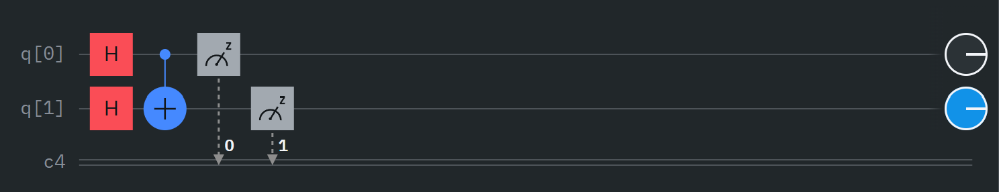
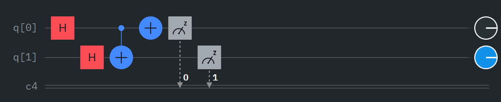
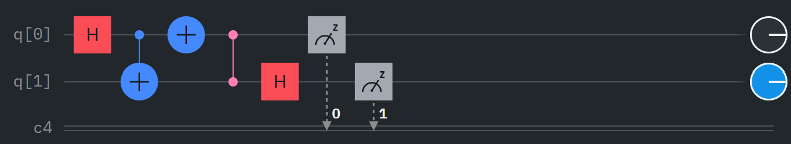

### Circuit Diagram for environment 1
- Built with IBM composer
- used for maliciousancillaZbasis.py

### Circuit Diagram for environment 2
- Built with IBM composer
- used for maliciousancillaZbasis2.py

### Circuit Diagram for environment 4
- Built with IBM composer
- used for maliciousancillaZbasis3.py
